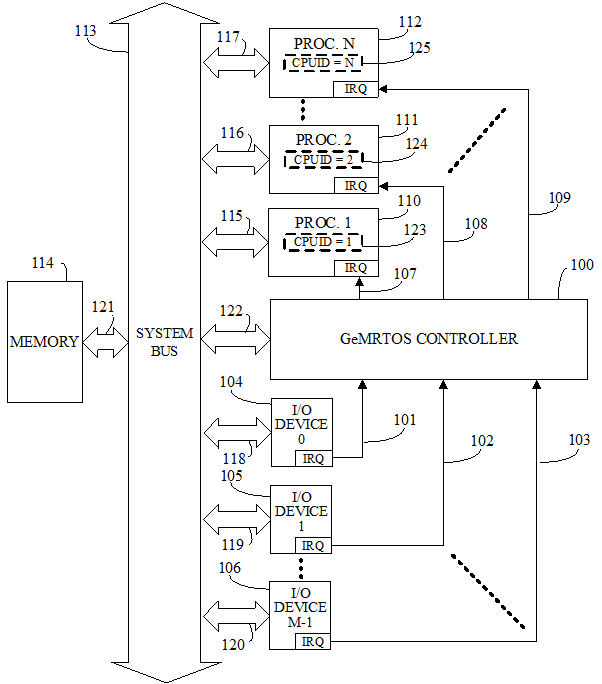
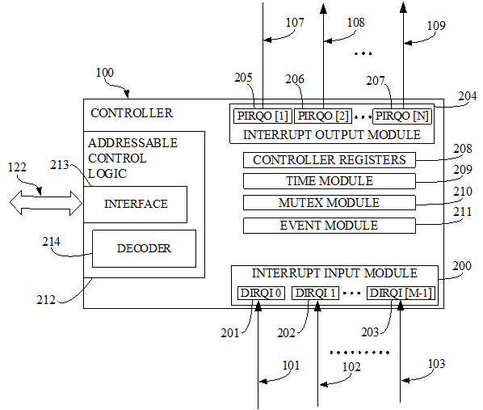
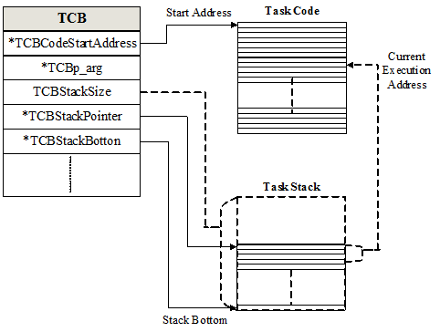
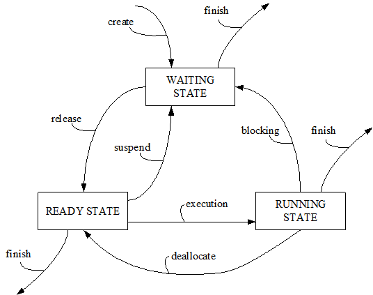
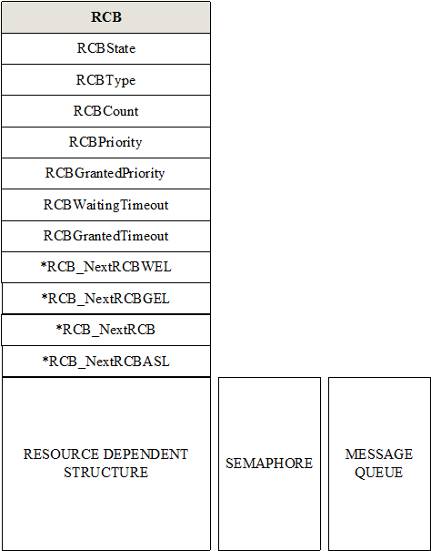
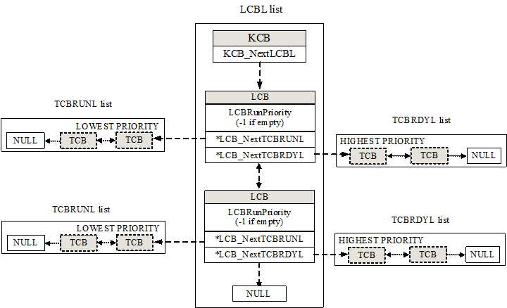
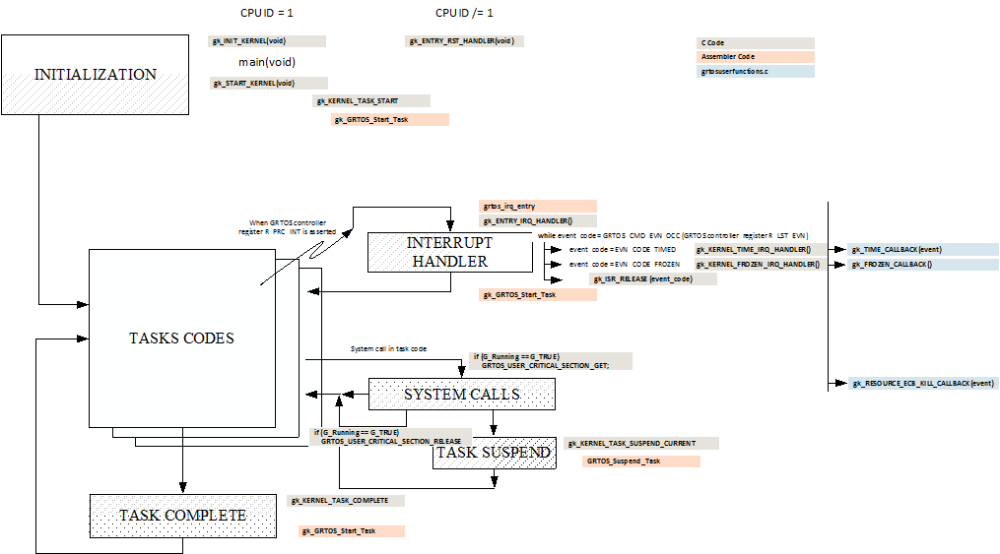
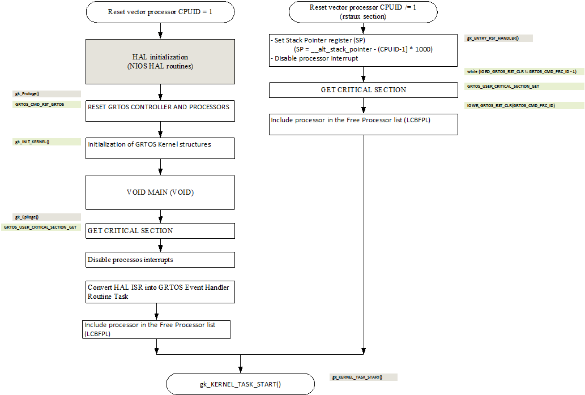

© Ricardo Cayssials. All rights reserved.

GeMRTOS
=======

The GeMRTOS is a multiprocessor system architecture for facilitating real-time multitasking processing. In GeMRTOS, each task is assigned to a list of tasks and one or more processors may serve that list (FIG. 1). Processors may serve one or more lists of tasks, thereby allowing the predictability of partitioned scheduling with a flexible balance of processor loads. Scheduling overhead is reduced using a timer-tickless scheduler. Floating scheduling reduces the overhead for the highest priority tasks and isolates the design of the system from the number of processors of the hardware architecture. The generic feature allows partial configuring global and partitioned scheduling.

FIG. 1: Scheduling lists in multiprocessor operating system.

Scheduling mechanism, priority disciplines, number of processors and fault-tolerance strategies can be global or partitioned and partially or totally implemented in the generic, timer-tickless and event-driven GeMRTOS system. The event-driven nature of the GeMRTOS system lets it produce low-overhead and high predictability. The frozen and unfrozen modes allow a responsive mechanism suitable for both fault tolerance implementations and the management of saturated situations.

GeMRTOS system architecture
===========================

In the GeMRTOS system architecture, a set of *N* processors shares a common memory and *M* input/output devices through a common bus. FIG. 1 shows a layout of the GRTIOS controller interconnection in a multiprocessor architecture. The GeMRTOS controller receives device interrupt requests (DIRQs) (101-103) from input/output peripheral devices (104-106). The GeMRTOS controller sends processor interrupt requests (PIRQs) (107-109) to the system processors (110-112). The system bus (113) allows the processors (110-112) to share the system memory (114). Each processor has a unique internal identification register CPUID (123-125).

FIG. 1: GeMRTOS multiprocessor system layout.

GeMRTOS with Intel Nios II[1] processors
----------------------------------------

The GeMRTOS multiprocessor system is implemented based on the Nios II processor of Intel Corporation. The system architecture is designed using the Platform Designer tool from Intel Corporation. The GeMRTOS architecture is included in the GeMRTOS Multiprocessor compound IP that includes: Nios II processors, GeMRTOS controller, debugging monitor and interfaces, bridges and configuration memories. The GeMRTOS Multiprocessor IP allows designer an easy configuration of the multiprocessor architecture.

GeMRTOS Controller
------------------

The GeMRTOS controller manages and synchronizes all the hardware events in the system. As shown in FIG. 2, the GeMRTOS controller includes the interrupt input module (200) containing device interrupt request inputs (DIRQIs) (201-203) that receives the device interrupt requests (DIRQs) (101-103), the interrupt output module (204) containing processor interrupt request outputs (PIRQOs) (205-207) sending the processor interrupt requests (PIRQs) (107-109), the controller registers (208), the time module (209), the mutex module (210), the event module (211) and the addressable control logic (212) including an interface element (213) and a decoder element (214).

FIG. 2: GeMRTOS controller architecture.

GeMRTOS controller registers
----------------------------

The behavior of the GeMRTOS controller is determined by a set of GeMRTOS controller registers (208). Some of these registers may be configured through the interface element of the GeMRTOS controller. They are assigned with a unique memory map address to be read and written. For instance, the R\_CTRL register can be used to configure some functions of the GeMRTOS controller such as enabling or disabling the frozen mode. The main GeMRTOS controller registers includes:

-   R\_CTRL

-   R\_MTX\_PRC\_GRN

-   R\_MTX\_CLR\_CNT

-   R\_MTX\_NXT\_PRC

-   R\_MTX\_RSV\_PRC

-   R\_NXT\_EVN\_CNT

-   R\_TM\_PSC

-   R\_TM\_CNT

-   R\_FRZ\_TM\_CNT

-   R\_TM\_PSC\_CNT

-   R\_NXT\_EVN\_TM

-   R\_FRZ\_TM\_THR

-   R\_NXT\_TM\_EVN\_PRC

-   R\_LOW\_PRI\_PRC

-   R\_TRG\_PRC\_INT

-   R\_INT\_ENB

-   R\_IRQ\_ENB

-   R\_INT\_CLR

-   R\_IRQ\_PND

-   R\_LST\_EVN

### GeMRTOS controller: internal signals

GeMRTOS controller uses internal signals to manage the different events of the multiprocessor hardware architecture. The main signals that produce system events include:

-   C1\_MTX\_GRN: C1\_MTX\_GRN signal is 0 when the R\_MTX\_PRC\_GRN register is equal to 0; otherwise, it is 1.

-   C1\_NXT\_EVN\_PRC\_ZRO

-   R1\_IRQ\_PND

-   R1\_FRZ\_MDE\_ENB

-   C1\_FRZ\_MDE

-   C1\_EVN\_TM\_OCC

-   C1\_IRQ\_PND

The states of these signals determines the behavior of the GeMRTOS controller.

Mutex module 210
----------------

In a multiprocessor system, a hardware-implemented mutex is required to preserve coherency in critical sections among the processors. The R\_MTX\_PRC\_GRN register, it is called the *mutex register*, is the main register of the mutex module and it is used to implement a critical section among the processors. A processor may execute a critical section when the value of the R\_MTX\_PRC\_GRN register is equal to its internal identification register CPUID. The R\_MTX\_PRC\_GRN register can take three different kinds of values:

-   0: there is no processor that grants the critical section. A processor may request the mutex when the R\_MTX\_PRC\_GRN register equals to 0.

-   values from 1 to *N*: the critical section is granted to the processor with internal identification register CPUID equal to the R\_MTX\_PRC\_GRN register.

-   constant MTX\_BLCK: the critical section is blocked when the R\_MTX\_CLR\_CNT register is different from 0. The value MTX\_BLCK is assigned to the R\_MTX\_PRC\_GRN register when the critical section is released by the processor that grants it. This mechanism blocks the critical section until the count of the R\_MTX\_CLR\_CNT register reaches a value equal to 0. The next processor to grant the critical section is stored in the R\_MTX\_NXT\_PRC register. The R\_MTX\_NXT\_PRC register is used to avoid an active competition among the processors that are requesting access to the mutex.

Before a processor starts executing a critical section code, the processor may request the mutex by repeatedly executing a mutex request and verifying that the mutex is granted to it by checking that the mutex register holds its identification CPUID. However, this mechanism may be inefficient when several processors simultaneously request the mutex. A more efficient mechanism is implemented using the R\_MTX\_RSV\_PRC register. Each processor sets the corresponding bit of the R\_MTX\_RSV\_PRC register according to its internal identification register CPUID executing the

GeMRTOS\_USER\_CRITICAL\_SECTION\_GET

instruction when the processor requests access to the mutex. The GeMRTOS controller halts a processor when its corresponding bit is set to 1 in the R\_MTX\_RSV\_PRC register and the mutex is not granted to it. The processor halt mechanism is implemented by asserting a wait\_request signal for each processor in the interface element of the GeMRTOS controller. The processor that grants the critical section executes the

GeMRTOS\_USER\_CRITICAL\_SECTION\_RELEASE

instruction to release the mutex in order to leave the critical section code.

GeMRTOS controller time module
------------------------------

Most applications require time support. For an adequate and flexible time basis, the system clock signal is prescaled through the up counter R\_TM\_PSC\_CNT register, as shown in FIG. 3.

FIG. 3: GeMRTOS time prescaler.

The modulus of the up-counter R\_TM\_PSC\_CNT register is equal to the value configured in the R\_TM\_PSC register plus 1. The R\_TM\_PSC register should be configured to obtain the desired system time unit, prescaling the CLK signal. The value stored in the R\_TM\_PSC register is set by executing a

GeMRTOS\_CMD\_SET\_TIME\_PRESCALE(scale)

instruction.

### GeMRTOS controller time modes

The GeMRTOS controller may stay in one of two time modes:

-   **unfrozen mode**: the GeMRTOS controller starts and remains in unfrozen mode while the condition (1) holds:

(R\_FRZ\_TM\_THR + R\_NXT\_EVN\_CNT &lt; R\_TM\_CNT and

C1\_FRZ\_MDE\_ENB == 1)

or

C1\_FRZ\_MDE\_ENB == 0

The up-counter R\_TM\_CNT, it is called the time counting register, is incremented at the system time unit rate when the GeMRTOS controller is in unfrozen mode.

-   **frozen mode**: the GeMRTOS controller switches to frozen mode when the C1\_FRZ\_MDE\_ENB is equal to one (frozen mode enabled) and the time elapsed since the next time event, stored in the R\_NXT\_EVN\_CNT, is greater than the threshold time configured in the R\_FRZ\_TM\_THR. In frozen mode, the up-counter R\_FRZ\_TM\_CNT, it is called the *frozen time counting register*, is incremented at the system time unit rate.

During runtime, the normal mode should be the unfrozen mode. In this mode, the system time is held in the up counter R\_TM\_CNT register. The GeMRTOS controller holds the next time event in the R\_NXT\_EVN\_CNT register. Each time that the up counter R\_TM\_CNT register reaches the value stored in the R\_NXT\_EVN\_CNT register, a time event is considered to have occurred. If the code associated with the time event is being executed by a system processor (the C1\_NXT\_EVN\_PRC\_ZRO signal is asserted), then the processor executing such code is interrupted; otherwise, the system processor with the lowest priority is interrupted. The interrupted system processor should execute the code to process the time event and then the R\_NXT\_EVN\_CNT register should be updated with the next system event. In this mode, the events are processed according to the time they happen. However, if the event processing takes longer than a certain threshold, it becomes convenient in some applications to freeze this dynamic in order to avoid a domino effect over the system events. When the frozen mode is enabled (C1\_FRZ\_MDE\_ENB signal is equal to one) and the next event remains unprocessed, with an interval equal to or greater than the time defined in the R\_FRZ\_TM\_THR register, then the GeMRTOS controller apparatus switches to frozen mode. In frozen mode, the up-counter R\_TM\_CNT register is frozen and the up-counter R\_FRZ\_TM\_CNT register is incremented at the system time unit rate. Consequently, the up-counter R\_TM\_CNT register keeps the time (in system time units) that the GeMRTOS controller remains in unfrozen mode, while the up counter R\_FRZ\_TM\_CNT register keeps the time (in system time units) that the GeMRTOS controller remains in frozen mode. When the GeMRTOS controller switches to frozen mode, the GeMRTOS controller produces an event (C1\_FRZ\_EVN). When all the time events are processed (R\_TM\_CNT &gt; R\_NXT\_EVN\_CNT), the GeMRTOS controller switches back to unfrozen mode.

### Unfrozen/frozen related instructions

-   GeMRTOS\_CMD\_FRZ\_ENB\_SET: Enables the frozen mode event

-   GeMRTOS\_CMD\_FRZ\_DSB\_SET: Disables the frozen mode event

-   GeMRTOS\_CMD\_GET\_FRZ\_ENB: Returns the status of the frozen mode (G\_TRUE if enabled, G\_FALSE if disabled)

-   GeMRTOS\_CMD\_GET\_FRZ\_ACT: Returns the status of the frozen mode event (G\_TRUE if active, G\_FALSE if inactive)

-   GeMRTOS\_CMD\_FRZ\_EVN\_CLR: Clears the C1\_FRZ\_EVN flags. It should be executed when the frozen mode strategy is completed.

-   GeMRTOS\_CMD\_FRZ\_TM\_THR\_SET(time): Sets the Frozen Time Threshold register (R\_FRZ\_TM\_THR) of the GeMRTOS controller.

-   GeMRTOS\_CMD\_FRZ\_TM\_THR\_GET: Returns the value of the Frozen Time Threshold (R\_FRZ\_TM\_THR) register of the GeMRTOS controller

Interrupt input module and interrupt output module
--------------------------------------------------

For most cases, an application is implemented as a set of tasks that has to be executed by system processors. A task may be defined as a program code that is executed by a processor in order to produce a certain function of an application. Because there may be more tasks than system processors a priority is assigned to each task in order to determine the order that tasks are scheduled on the system . Higher priority tasks are executed first. Lower priority tasks are executed when highest priority tasks do not require system processors to be executed.

The pattern of the tasks requiring execution changes during runtime according to the events that occur. When one event takes place, a system processor must be interrupted in order to execute the code that processes that event. At a GeMRTOS controller level, events that produce processor interrupt requests (PIRQs) , may be classified as:

-   **time events**: these events are configured to happen at a certain system time. Time events may be sorted according to the occurrence time in a total order relationship. The next time the event is the earliest time event. Several embodiments may be utilized to break ties when two or more time events are configured with the same occurrence time. A time event takes place when the following condition holds:

R\_NXT\_EVN\_CNT &gt;= R\_TM\_CNT (2)

where the R\_NXT\_EVN\_CNT register holds the earliest occurrence time event and the up-counter R\_TM\_CNT register keeps the system time. The C1\_EVN\_TM\_OCC signal is asserted when Equation (2) is true; otherwise, it is de-asserted. In the R\_NXT\_TM\_EVN\_PRC register, the bit corresponding to the processor that executes the task associated with the next timed event is set to 1. Otherwise, if the next time event is not associated with an executing task, all the bits of the R\_NXT\_TM\_EVN\_PRC register should be set to 0.

-   **device interrupt requests (DIRQs) events**: these events are produced by the input/output peripheral devices connected to the of input/output peripheral device ports. Most of these events require the execution of the associated interrupt service routine (ISR) in order to satisfy the demand of the input/output peripheral device. Interrupt requests from device interrupt requests (DIRQs) may be enabled or disabled by setting or clearing, respectively, the corresponding bit in the R\_IRQ\_ENB register. Therefore, a device interrupt request (DIRQ) will produce a processor interrupt request (PIRQ) when there exists a request from that device and the corresponding bit in the R\_IRQ\_ENB register is enabled.

-   **internal interrupt trigger events**: a processor may interrupt another processor using the R\_TRG\_PRC\_INT register. Setting the corresponding bit of the R\_TRG\_PRC\_INT register triggers the interrupt (bit 0: processor 1, bit 1: processor 2, etc.).

The processor interrupt requests (PIRQs) may be enabled or disabled by setting the corresponding bit of the R\_INT\_ENB register. When there exists at least a pending interrupt, then the C1\_IRQ\_PND signal is set to 1, otherwise, it is set to 0.

A processor should be interrupted (the corresponding processor interrupt request (PIRQ) of the GeMRTOS controller should be asserted) when:

Critical section is not granted to any processor (the C1\_MTX\_GRN signal is not set), the processor interrupt is enabled (the corresponding bit of the R\_INT\_ENB register is set) and:

1.  the processor is executing the task associated with the next time event (the corresponding bit of the R\_NXT\_TM\_EVN\_PRC register is set) and a time event occurred (the C1\_EVN\_TM\_OCC signal is set), or

2.  the processor is executing the lowest priority task (the corresponding bit of the R\_LOW\_PRI\_PRC register is set) and there is an IRQ request pending (the C1\_IRQ\_PND signal is set), or

3.  the processor is executing the lowest priority task (the corresponding bit of the R\_LOW\_PRI\_PRC register is set), a time event occurred (the C1\_EVN\_TM\_OCC signal is set) and no processor is executing the next time event (the C1\_EVN\_TM\_OCC signal is not set).

Trigger processor interrupt is set (the corresponding bit of the R\_TRG\_PRC\_INT register is set) and the processor interrupt is enabled (the corresponding bit of the R\_INT\_ENB register is set).

The processor interrupt request outputs (PIRQOs) are registered to avoid spurious triggers. The R\_IRQ\_PND register preserves the status of the pending processor interrupts that should be reset by the proper processor when it executes the interrupt handler routine (ISR). The R\_INT\_CLR register allows clearing the bit in the R\_IRQ\_PND register of the corresponding processor interrupt in the GeMRTOS controller. The R1\_IRQ\_PND signal is asserted when a pending interrupt is set.

When a processor is interrupted, it should execute the interrupt service routine (ISR). When the ISR is executed, the processor interrupt is disabled in the GeMRTOS controller (R\_INT\_ENB register). To avoid being interrupted in the ISR, the mutex is requested for access to the critical section and then the processor waits until the mutex access is granted.

When the system requires a processor to execute a higher priority task, the GeMRTOS controller interrupts the processor that is executing the lowest priority task. In the R\_LOW\_PRI\_PRC register, the bit corresponding to the processor that is executing the lowest priority task is set to 1; otherwise, it is set to 0.

### Input/output interrupts related instructions

-   GeMRTOS\_CMD\_IRQ\_ENB\_CLR(*irq*): Disables the device interrupt request event *irq* (DIRQ).

-   GeMRTOS\_CMD\_IRQ\_ENB\_SET(*irq*): Enables the device interrupt request event *irq* (DIRQ).

-   GeMRTOS\_CMD\_NXT\_TM\_PRC\_SET(*processor*): Sets the Lowest Priority Processor in the GeMRTOS Controller.

-   GeMRTOS\_CMD\_NXT\_OCC\_TM\_EVN\_SET(*timeset*): Sets the Next Occurence Time register of the GeMRTOS controller to produce a timed event when system time reaches the value of *timeset*.

-   GeMRTOS\_CMD\_LOW\_PRC\_SET(*processor*): Sets the processor with CPUID equal to *processor* as the Lowest Priority Processor in the GeMRTOS Controller.

-   GeMRTOS\_CMD\_CRITICAL\_SECTION\_GET: Defines the entry to a critical section to handle system variables and ISR routines. It asks for critical section and puts the processor in halt mode. GeMRTOS controller enables the processor when section is granted to it.

-   GeMRTOS\_CMD\_CRITICAL\_SECTION\_RELEASE: Releases the critical section from the current processor. The final released is delayed by the controller to let the processor finishes executing the return from the critical section. It should be executed from the interrupt routine.

-   GeMRTOS\_CMD\_MTX\_RQS\_GET: Returns the current value of the Mutex.

-   GeMRTOS\_CMD\_PRC\_INT\_ENB: Enables the processor interrupt request of the current processor in the GeMRTOS controller

-   GeMRTOS\_CMD\_PRC\_INT\_DSB: Disables the interrupt of the current processor in the GeMRTOS controller.

-   GeMRTOS\_CMD\_IRQ\_ENB\_GET(*irq*): Reads the enabled status of the device interrupt request (DIRQ) *irq.*

-   GeMRTOS\_CMD\_TRG\_PRC\_INT\_SET(*proc*): Interrupts the processor *proc*. If proc interrupt is enabled in the GeMRTOS controller, then the processor is interrupted.

-   GeMRTOS\_CMD\_INT\_PRC\_PND\_CLR: Clears the pending interrupt of the current processor.

Event module
------------

The GeMRTOS controller handles a set of events and determines the way they are managed to preserve the consistency of the system. When a processor is interrupted because an event happened, it must execute the event handler routine associated with that event. Once the critical section is granted in the ISR, the processor must get the event that produced the interrupt by reading the event code in the R\_LST\_EVN register.

When a processor executes the GeMRTOS\_CMD\_EVN\_OCC instruction, the R\_LST\_EVN register is transferred through the interface element to the processor. Several events may be asserted when the processor reads the R\_LST\_EVN register. In order to avoid inconsistency, the event module sorts the events and assigns to the R\_LST\_EVN register the code of the asserted event with the lowest sorted order. The sorted list of events of GeMRTOS controller is:

-   FROZEN event code (EVN\_CODE\_FROZEN, sorted order 1): This event takes place when the GeMRTOS controller changes from unfrozen mode to frozen mode. The C1\_FRZ\_MDE\_ENB and C1\_FRZ\_EVN signals should be clear to allow accessing the rest of events when the GeMRTOS controller is in frozen mode.

-   TIMED event code (EVN\_CODE\_TIMED, sorted order 2): This event takes place when a time event happens (C1\_EVN\_TM\_OCC signal is asserted).

-   DIRQ*i*\_CODE (DIRQ event codes, sorted order 3 to ...): The DIRQ*i*\_CODE is asserted when there is a pending request from the device interrupt requests (DIRQs) with the index *i*

### Event module related instructions

-   GeMRTOS\_CMD\_EVN\_OCC: Returns the event happened from the GeMRTOS controller

System components and Data Structures
=====================================

Task 
----

A task is defined as a unit of execution. FIG. 4 shows the main components of a task implementation that consists of:

-   **TCB data structure**: this is a control block (TCB) that stores the information required for task management.

-   **task code**: this is the executable code, loaded into the system memory, that implements a task function when it is executed by a processor.

-   **task stack**: this is data storage to preserve the status of a suspended task in order to resume it properly and store subroutine data.

FIG. 4: Task components and structure.

Tasks are executed by the processors to produce their designed functions. A task may stay in different states. FIG. 5 shows an embodiment of these states and the different events that produce their changes:

-   **waiting state**: the task is waiting for an event to release. When a task is in the waiting state, it is called a “*waiting task*”.

-   **ready state**: the task is ready to be executed and it is waiting to grant a processor for execution. A task in the ready state is called a “*ready task*”.

-   **running state**: the task is executing on a processor. A task is executed until it finishes the execution or is preempted by a higher priority task. A task in the running state is called an “*executing task*”.

FIG. 5: Task states and events.

There are different causes of changes in the state of a task such as an event in a device interrupt requests (DIRQs), an internal time event, an event produced by another task or, the availability of a requested resource as well as other events specified in the system. In FIG. 5, the state changes are grouped in the following set of events:

-   **create events**: create a task and set its state as the waiting state. All tasks should be created through a create event. When a task is created, its stack is initialized to start execution from the start address of the task.

-   **release events**: change the state of the task from the waiting state to the ready state. The state of a task changes to the ready state when that task is ready to be executed by a processor.

-   **suspend events**: change the state of a task from the ready state to the waiting state. The status of the task is saved into the task stack in order to restore it when it is resumed.

-   **blocking events**: change the state of a task from the running state to the waiting state.

-   **execution events**: change the state of a task from the ready state to the running state. A processor restores its status from the task stack.

-   **deallocate events**: change the state of a task from the running state to the ready state. When a task is deallocated, its status is saved in the task stack in order to restore it when an execution event returns it to the running state. Consequently, the task executes as if it had not been deallocated.

-   **finish events**: destroy a task. A finish event destroys a task-independent of its state.

The tasks may be classified into three main kinds:

-   **User Task**: this task is released for execution according to the configuration that the user performed. It can be executed periodically or when an internal event occurs.

-   **Event Handler Routine Task**: this task is released when an event occurs in a device interrupt request (DIRQ). An Event Handler Routine Task is associated with that device interrupt request (DIRQ). Event Handler Routine Tasks are created when an ISR is associated with the device interrupt request (DIRQ). These Event Handler Routine tasks will be the code of the task to be released each time that the associated, and enabled, device interrupt request (DIRQ) occurs.

-   **Idle Task**: this task is executed when neither user tasks nor interrupt tasks are ready for execution. An idle task may turn a processor to a low power consumption state until the next event that requires processing.

Tasks and events are closely related because events change the status of the tasks.

Events 
------

The GeMRTOS supports external and internal events. External events come from the GeMRTOS controller to the processors through the processor interrupt requests (PIRQs) and are processed by the GeMRTOS in the interrupt handler routine of the system.

Internal events are produced by different conditions, such as when an executing task is deallocated, an executing task completes, etc. The GeMRTOS uses ECB data structures to handle all the events of the system. ECB data structures are linked with TCB data structures to properly manage changes in the states of tasks.

Time
----

Time is important because it marks when events occur. The R\_TM\_CNT register of the GeMRTOS controller holds the system time and the R\_FRZ\_TM\_CNT register holds the length of time the system stayed in frozen mode. The GeMRTOS controller produces a time event (C1\_EVN\_TM\_OCC signal) each time the R\_TM\_CNT register reaches the value stored in the R\_NXT\_EVN\_CNT register.

Resources
---------

In a multitasking system, tasks may share the utilization of the system’s resources, such as data memory sections, code memory sections or input/output devices as well as other special resources. To manage the utilization of these resources and share them among tasks efficiently, an operating system should offer an adequate resource management mechanism. This mechanism offers data structures and functions to handle the sharing of system resources among the tasks that require their utilization.

The GeMRTOS implements the data structure of a resource in the RCB data structure. The RCB data structure supports a linked list to ECB data structures to manage the events associated with resources, in addition to the data fields required to implement the functionalities of specific kinds of resources. When a task requests a resource, (1) the resource may be granted to the task if it is available or (2) the task may be blocked if it must wait until the resource becomes available. Moreover, a timeout may need to be specified in order to avoid a task either granting or waiting for a resource for a long time, which would impede the adequate sharing of resources among tasks.

FIG. 6 shows a RCB structure to support semaphore or message queue functionality that can be extended to different kinds of system resources.

FIG. 6: Resource extensions of RCB data structure.

Signals
-------

Signals in operating systems handle exceptional conditions that may happen during runtime. Signals allow tasks to execute associated code when a certain condition takes place. Some of these conditions may be defined, for instance, as when a task is created, a resource is granted or a task is blocked. The SCB data structure is defined to store the signal information and it is linked to data structures accordingly.

The SCB data structure points to the code to be executed when the condition of the signal occurs. This code is executed prior to the execution of the code of the task with which the signal is associated.

Ready and Running Linked Lists (TCBRDYL list and TCBRUNL list)
--------------------------------------------------------------

Tasks in the ready state are grouped in the Ready Linked Lists. LCB data structures allow holding information about the tasks ready for execution and the tasks currently executing in a determined TCBRDYL list. Several ready linked lists may be defined in order to group the tasks of the system according to each one’s function and the function of the group. FIG. 7 the LCBL list that links all the LCB data structures of the system. When a task is in the ready state, it should be linked to a TCBRDYL list; when a task is in the running state, it should be linked to a TCBRUNL list.

FIG. 7: Ready and Running LCB lists.

Processors
----------

The processors executes the code of the operating system, tasks, and signals. The GeMRTOS is in charge of sharing the utilization of the processors among the system tasks. Each processor should be assigned to execute the highest priority tasks in the ready state. A PCB data structure stores the state of a processor and the ready linked lists that the processor may serve. A processor may serve several TCBRDYL lists and several processors may serve to the same TCBRDYL list.

The LCBL list shown in FIG. 7 sorts the LCB data structures according to the priority of the tasks executed by each processor. In this way, it is easy to determine the lowest priority processor to be defined in the R\_LOW\_PRI\_PRC register of the GeMRTOS controller.

RRDS data structure
-------------------

Each request for a resource may include an RRDS data structure that contains the specific information for that request. If the pointer to an RRDS data structure 1210 in the RCBType field is NULL, then the default values of the resource are considered.

Control block fields
====================

Each of the control blocks holds all the information required to perform its functions and the links required for the linked lists in fields of the data structure. The system control blocks include:

-   KCB data structure: holds the main information about the operating system.

-   TCB data structure: holds the support information required for the tasks

-   ECB data structure: holds information about an event.

-   RCB data structure: holds information about a resource such as: Semaphores or Message queues.

-   SCB data structure: holds information used to manage internal signals that can be produced during runtime.

-   LCB data structure: allows organizing the group of tasks to be executed by one or several processors and the sharing of processors among LCB data structures. In a multiprocessor system, tasks may be grouped, through LCB data structure, to be executed by either one or several processors in order to produce a certain performance or function.

-   PCB data structure: holds the information of one processor. Each processor of the system requires a data structure to preserve its status during runtime.

-   RRDS data structure: holds information of the specific resource request. The information of the RRDS data structure depends on the resource it is associated.

GeMRTOS structure
-----------------

FIG. 8 shows the GeMRTOS code structure. Shadow sections are executed in the critical section of the GeMRTOS controller. The GeMRTOS structure includes the following sections:

-   **initialization section**: initializes the data structures of the computer program.

-   **task start section**: restores the state of the next task to be executed by the processor.

-   **interrupt handler section**: the code section that should be executed when the GeMRTOS controller asserts a processor interrupt request (PIRQ). The code of this section is executed in the critical section of the GeMRTOS controller.

-   **task switch section**: checks if task context switching is required and saves and restores the task status accordingly. It also checks when a pending signal must be executed and sets the task stack for its execution.

-   **system call section**: groups the functions that the computer program allows to call from tasks. System calls may be called from tasks but require granting the critical section of the GeMRTOS controller to be executed.

-   **tasks codes**: are executed by system processors. Tasks codes are executed outside the critical section of the GeMRTOS controller, but the critical section may be requested when a task code calls a system call. The task stack stores the data and information required for the task code to be executed during runtime. A TCB data structure is associated with each task to hold all the task statuses required by the GeMRTOS for execution.

-   **task suspend section**: some system calls produce blocking events that require saving the status of the task and restoring the status of the highest priority task in order to execute the next ready task while the calling task waits for a release event.

-   **task complete section**: is executed when a task completes its execution. The task state is changed to the waiting state and its status is saved. Then, the start task section is called.

FIG. 8: GeMRTOS structure.

Initialization section
----------------------

FIG. 9 shows the structure of the initialization section that sets the initial value of the data structures of the GeMRTOS. At the beginning, the stack pointer register (SP) of each processor is configured with a unique stack memory address to avoid conflicts among processors. In order to synchronize the initialization, only the processor whose internal identification register CPUID is equal to 1 executes the configuration code of the data structures and the GeMRTOS controller. The rest of the processors waits, until the critical section is granted to the processor with an internal identification, register CPUID equal to 1. Then, they request the critical section and wait for it to be granted. This mechanism guarantees that: (1) the initialization code section is executed before any other section and (2) the rest of processors start executing tasks codes after the initialization of the system.

FIG. 9: Initialization section structure.

The processor with an internal identification register CPUID equal to 1:

resets the GeMRTOS controller and the rest of the processors: sets R\_PRC\_RST register to 0 by executing a GeMRTOS\_CMD\_RST\_GeMRTOS instruction. The internal registers of the GeMRTOS controller are set to their initial values and the processors with CPUID different from 1 are reset.

gets access to the critical section of the GeMRTOS controller: to avoid consistency errors when data structures and linked lists are initialized.

initializes data structures: all the data structures of the computer program are created with their initial values.

initializes linked lists: all linked lists are created in their initial states.

initializes interrupt and idle tasks: creates the interrupt task associating the ISR of each device interrupt request (DIRQ). An idle task is created for each processor of the system.

executes the main routine (main()) defined in the user program. The user initializes and creates the user tasks and interrupt tasks in this routine.

The rest of the processors of the plurality of processors 110-112:

assign an unique stack for each processor of the system.

wait until the R\_PRC\_RST register is equal to CPUID – 1.

get the critical section: processors are synchronized to start the execution of user tasks requesting the critical section of the GeMRTOS controller.

assign the value of CPUID to the R\_PRC\_RST register. This assignment enables the next processor to start its configuration.

When the initialization section is executed, the start task section is executed.

Task switch section
-------------------

FIG. 10 shows the structure of the task switch section. This section implements the methods for saving and restoring task statuses according to the states of the tasks. Prior to executing the code of the next task, the pending signals are executed and then, when there is no other pending signal, the code of the task is resumed. The task switch section presents three entry points:

-   **GeMRTOS\_Suspend\_Task**t: saves the status of the current task and restores the status of the idle task of the processor.

-   **GeMRTOS\_irq\_entry**: saves the status of the current task and restores the status of the idle task of the processor.

-   **GeMRTOS\_Return\_from\_signal**: when there exists a pending signal for a task, the RETURN\_FROM\_SIGNAL is configured as the return entry point.

-   **GeMRTOS\_Start\_Task**: restore the status of the next task to be executed and return. If signal is pending, the task stack is modify to execute the signal code when returning from interrupt and the return address is set to GeMRTOS\_Return\_from\_signal.

FIG. 10: Task switch section structure.

The task switch section is completed by executing a return from interrupt in order to enable the processor interrupt. Before leaving the section, the critical section is released and the corresponding processor interrupt request (PIRQ) of the GeMRTOS controller is enabled.

Interrupt handler section
-------------------------

The code of the interrupt handler is executed by the processors when some of them receive a processor interrupt request (PIRQ) from the GeMRTOS controller and produces a C1\_IRQ\_PND signal. When a processor receives an interrupt request from a device interrupt request (DIRQ), the processor disables the processor interrupt, and starts executing the interrupt handler section. In the interrupt handler, the processor performs the following procedures:

the status of the processor is saved into the task stack. All the processor registers are pushed into the task stack in order to restore them when the interrupted task is resumed.

the status of the idle task is restored from the idle task stack. The interrupt section is executed as the idle task of the processor in order to avoid task status inconsistencies.

the processor interrupt request (PIRQ) of the GeMRTOS controller associated with the processor is disabled. No new interrupt will be produced to the processor by the GeMRTOS controller while it is executing the interrupt handler section.

the processor interrupt request (PIRQ) of the GeMRTOS controller associated with the processor is cleared. The interrupt request is cleared to avoid a new request when it is enabled.

the critical section of the GeMRTOS controller is requested. The processor waits while requesting the critical section of the GeMRTOS controller until it is granted to the processor.

the R\_LST\_EVN register of the GeMRTOS controller is read to get the last event that occurred. According to the code read from the R\_LST\_EVN register of the GeMRTOS controller, the following is performed:

Code EVN\_CODE\_FROZEN: the gk\_KERNEL\_FROZEN\_IRQ\_HANDLER routine is called to perform the procedure according to the type of time event that produced the interrupt while the system time is frozen. This routine calls the gk\_FROZEN\_CALLBACK() routine in grtosfunctions.c file.

Code EVN\_CODE\_TIMED: the gk\_KERNEL\_TIME\_IRQ\_HANDLER() routine is called to perform the procedure according to the type of time event that produced the current EVN\_CODE\_TIMED event. This routine calls the gk\_TIME\_CALLBACK() routine in grtosfunctions.c file.

Code DIRQ*i*\_CODE: (1) the requesting device interrupt request (DIRQ) is disabled in the GeMRTOS controller, (2) the TCB data structures associated with the task interrupt of the device interrupt request (DIRQ) are unlinked from the interrupt list to which it is currently linked, (3) the task stack 1601 of the interrupt tasks are initialized and (4) the TCB data structures are linked to the TCBRDYL list.

Zero (0): there are no more events to process from the GeMRTOS controller and consequently it calls the SWITCH\_SUSPEND\_TASK to execute the next task.

The R\_LST\_EVN register of the GeMRTOS controller is read until the value returned is equal to 0.

System call section
-------------------

System calls are called from tasks and are executed in the critical section of the GeMRTOS controller . The execution of the system call depends on the specific system call. Some system calls do not require a context switch and consequently the critical section of the GeMRTOS controller is released before returning to the caller task. In contrast, when a task requires a context switch, the SWITCH\_SUSPEND\_TASK entry point in the task switch section is called. When the task is resumed, the system call should complete its execution but getting the critical section first.

Task suspend section
--------------------

When a task is suspended, the following procedure is performed:

1.  the TCB data structure of the task is unlinked from the TCBRUNL list and then linked to the TCBWL list. The task remains in the waiting state until a release event changes it to the ready state.

2.  the next task to execute is chosen among tasks in the ready state that may be executed by the current processor.

3.  the next task is linked to the TCBRUNL list and its state is changed to the running state.

4.  the processor interrupt is set to the running priority of the next task, the LCBL list is updated accordingly and the lowest priority processor register is set in the GeMRTOS controller.

5.  the priority inversion is checked in order to verify that there is no task in the ready state with higher priority than any task in the running state for the TCBRUNL list of the next task. If there is a task in the ready state with a higher priority than a task that is currently being executed for a processor in the TCBRUNL list, then the processor interrupt request (PIRQ) in the GeMRTOS controller is triggered.

6.  the next time processor is set in the GeMRTOS controller .

7.  the SWITCH\_SUSPEND\_TASK entry point in the task switch section is called to produce the context switching of a suspended task.

Task complete section
---------------------

The complete task section is executed when a task finishes its execution. Then, the COMPLETE\_TASK entry is configured as the returning point when a task is started and consequently is the return address when the task finishes its execution. The following steps are executed to complete the execution of a task:

-   the TCB data structure of the current task is unlinked from the TCBRUNL list.

-   the TCB data structure of the task is linked to the TCBWL list.

-   if task is an Interrupt Task, then the corresponding device interrupt request (DIRQ) is enabled for further requests.

-   the highest priority task for the current processor is selected as the next executing task.

-   the TCB data structure of the next task is unlinked from the TCBRDYL list.

-   the TCB data structure of the next task is linked to the TCBRUNL list and its state is changed to the running state,

-   the R\_LOW\_PRI\_PRC register of the GeMRTOS controller is set with the processor that is executing the lowest priority task.

-   the priority inversion is checked in order to verify that there is no task in the ready state with higher priority than any task in the running state for the TCBRUNL list of the next task. If there is a task in the ready state with a higher priority than a task that is being executed for a processor in the TCBRUNL list, then the processor interrupt request (PIRQ) in the GeMRTOS controller is triggered.

-   the R\_NXT\_TM\_EVN\_PRC register in the GeMRTOS controller is set with the processor that is executing the task that produces the next time event (0 if no task is executing the next time event).

-   the gk\_GeMRTOS\_Start\_Task is called to produce context switching of a suspended task.

Priority Management
===================

Priority discipline determines the sequence in which tasks are executed. A priority discipline defines a total order among tasks in the ready state. The TCBRDYL lists sort the TCB data structures of the tasks according to the TCBReadyPriority field. By previously setting the TCBReadyPriority field to link the TCB data structure to the TCBRDYL lists (by executing the gk\_TCBRDYL\_Link(GS\_TCB \*ptcb) function), different priority disciplines may be implemented. For instance, leaving a constant value in the TCBReadyPriority field implements a Fixed Priority discipline, while assigning TCBReadyPriority field = gk\_now + TCBDeadline field 1907 implements an Earliest Deadline First priority discipline.

-   Nios is a trademark of Intel Corporation or its subsidiaries.

All text, source code, figures and diagrams are exclusive property of Ricardo Cayssials.

Distribution, use in presentations, or publications in any form is strictly prohibited without prior written authority from Ricardo Cayssials.

Ricardo Cayssials retains and reserves all rights.

© Ricardo Cayssials 2017-2021. All rights reserved.

GeMRTOS (USPTO Patent Pending)

[1] *Nios is a trademark of Intel Corporation or its subsidiaries.*
